# Design
Depicts vaious design aspects associates with this project.

Table of contents
=================

<!--ts-->
   * [Case](#Case)
      * [Case BOM](#Case-BOM)
   * [Keyboard Module](#Keyboard-Module)
      * [Keyboard BOM](#Keyboard-BOM)
   * [NumPad Module](#NumPad-Module)
      * [NumPad BOM](#NumPad-BOM)
   * [Joystick Module](#Joystick-Module)
      * [Joystick BOM](#Joystick-BOM)
<!--te-->

Case
====

|:--:| 
| *Rendering of Casing for Calculator.* |

## AutoCAD Drawings
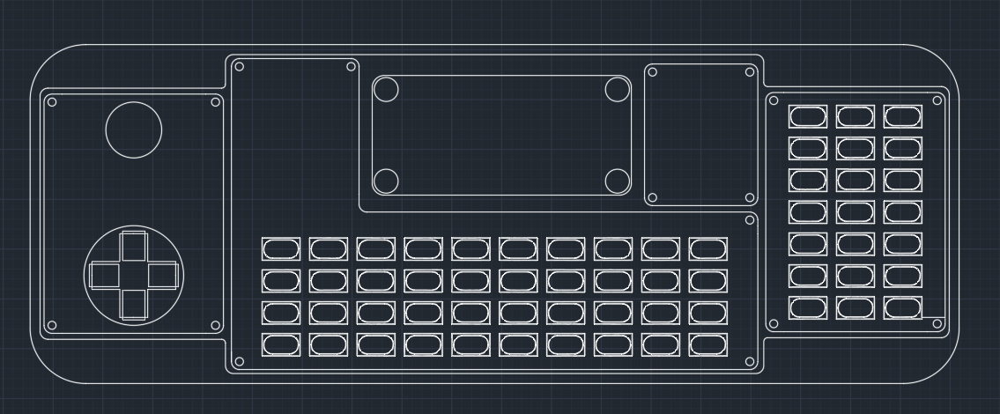
|:--:| 
| *2D Outline of Case in AutoCAD* |

Mocked up in AutoCAD to determine layout, espcially in regards to PCB orientation and configuration. Exported as a dxf, and utilized to build enclosure in Fusion360 from this initial sketching. All dimensions for the Fusion360 model determined from this intial sketch.

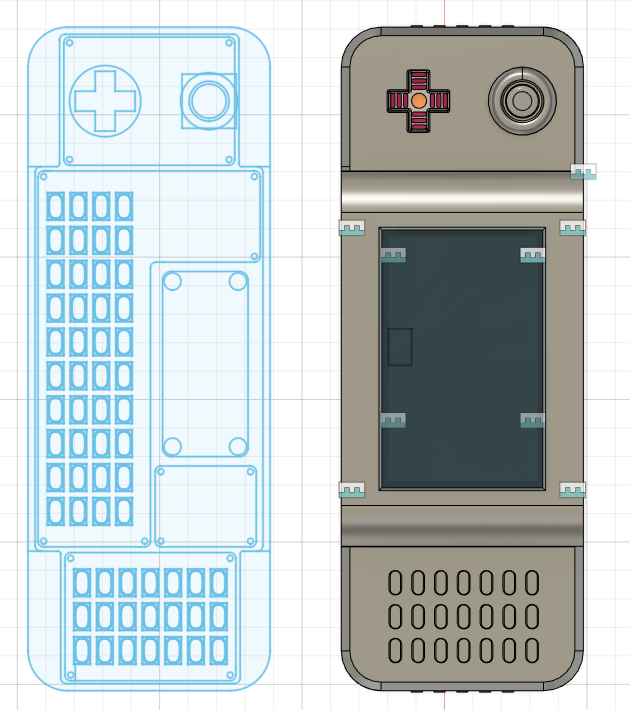
|:--:| 
| *Comparision between the initial 2D AutoCAD sketch, and the finalized model in Fusion360.* |

## Fusion360 Models
### Case Bottom
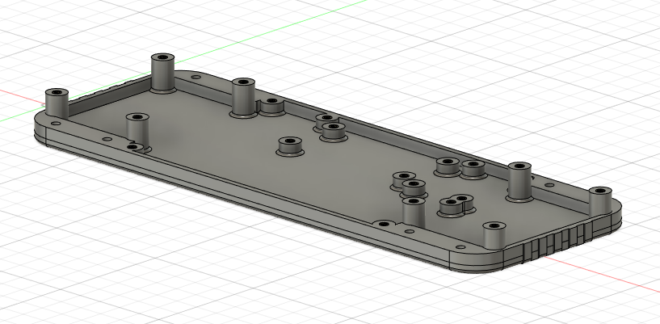
|:--:|
| *Bottom Case for Calculator.* |

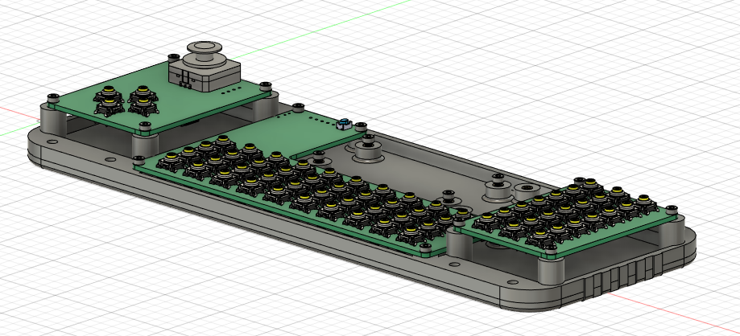
|:--:|
| *Bottom Case for Calculator with PCB's included.* |

### Case Top
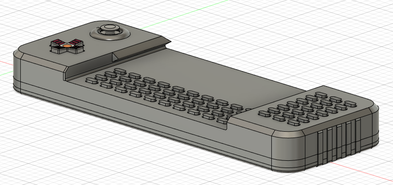
|:--:|
| *Top Case for Calculator.* |

### Case All
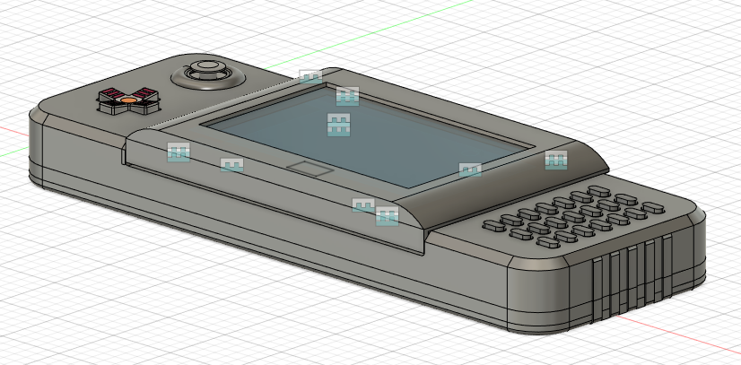
|:--:|
| *Full Case Design for Calculator.* |

Case BOM
--------

All casing produced and manufactured by PCBWay's Stereolithography (SLA) Printing Service[^1]. This SLA service allows for precise and accurate feature resolution. For this project, the material of choice was the standard white material (UTR 8360), providing great dimensinoal accuracy while also being durable. Pricing for each part of the enclosure is shown in the table below.

| Component | Cost |
| --- | --- |
| Display Top | $4.98 |
| Display Bottom | $8.46 |
| Case Top | $16.68 |
| Case Bottom | $17.42 |

Keyboard Module
===============

The keyboard module is responsible for alphabetical input from the user. This is handled by a full qwerty keyboard, in addition to other keys aswell.

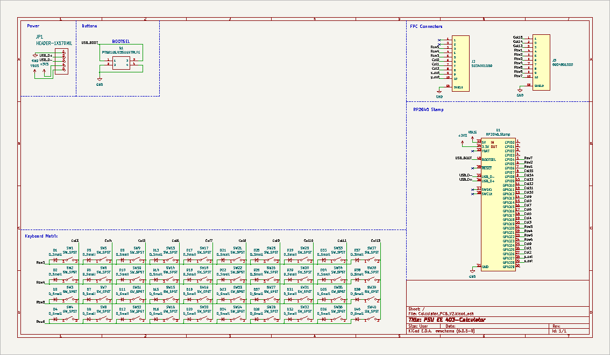
|:--:|
| *Keyboard Module KiCAD Schematic.* |

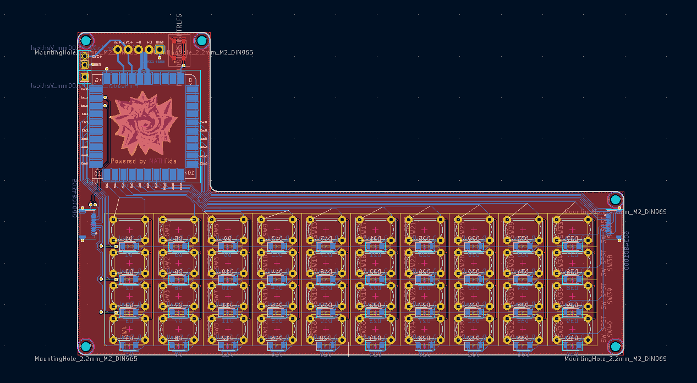
|:--:|
| *Keyboard Module PCB Routing and Component Placement.* |

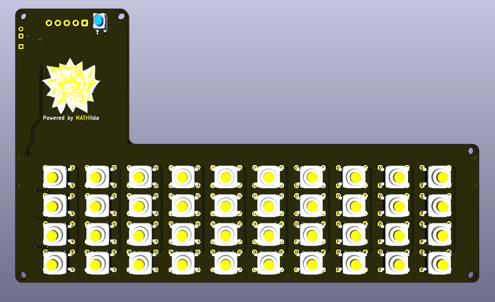
|:--:|
| *3D Render of Keyboard Module PCB.* |

)
|:--:|
| *2nd 3D Render of Keyboard Module PCB.* |

Keyboard BOM
------------

Keyboard module PCB manufactured by PCBway's PCB fabrication service. The following table details the components used within the module, along with information on pricing for the actual PCB.

| Component | Cost | Link |
| --- | --- | --- |
| RP2040 Stamp | $12.00 | https://www.tindie.com/products/arturo182/rp2040-stamp/ |
| KSA1M331LFT SPST-NO | $0.91 | https://www.digikey.com/en/products/detail/c-k/KSA1M331LFT/1003897 |
| Tactile Cap Oval (BLACK) | $0.39 | https://www.digikey.com/en/products/detail/c-k/BTNK0390/559405 |
| FPC 10Pin Connector | $1.13 | https://www.digikey.com/en/products/detail/molex/5034801000/2356624 |
| FPC 10Pin Cable | $3.74 | https://www.digikey.com/en/products/detail/molex/0152660095/3160830 |
|1N4148WTPMSCT-ND Diode| $0.03816 | https://www.digikey.com/en/products/detail/micro-commercial-co/1N4148W-TP/717196 |
| PTS810SJK250SMTRLFS | $0.36 | https://www.mouser.com/ProductDetail/611-PTS810SJK250SMTR |
|Keyboard Module PCB| $51.58 |  |

NumPad Module
=============

The numpad module is responsible for numerical input, as well as mathmatical operations. This is handled by a 7x3 button matrix.

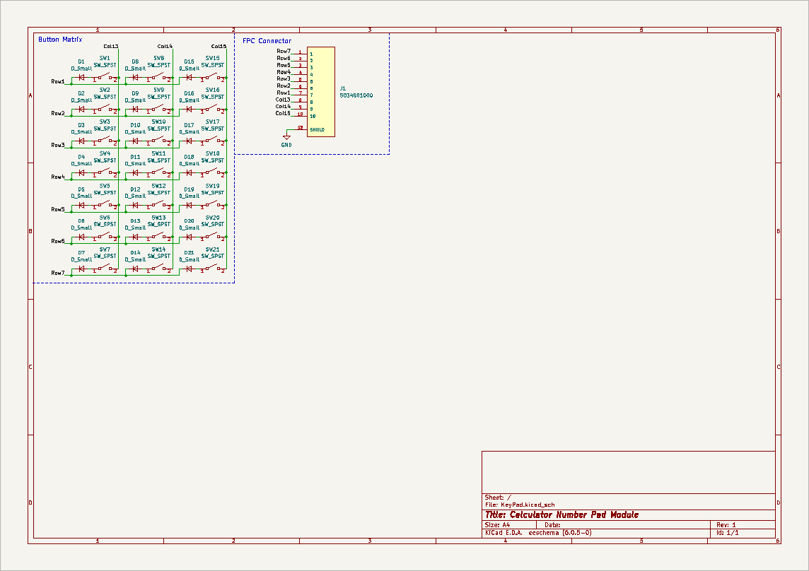
|:--:|
| *NumPad Module KiCAD Schematic.* |

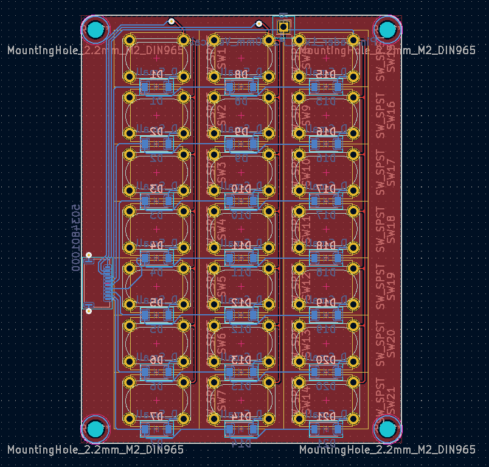
|:--:|
| *NumPad Module PCB Routing and Component Placement.* |

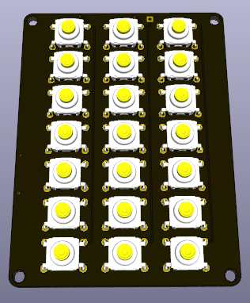
|:--:|
| *3D Render of NumPad Module PCB.* |

NumPad BOM
----------

NumPad module PCB manufactured by PCBway's PCB fabrication service. The following table details the components used within the module, along with information on pricing for the actual PCB.

| Component | Cost | Link |
| --- | --- | --- |
| KSA1M331LFT SPST-NO | $0.91 | https://www.digikey.com/en/products/detail/c-k/KSA1M331LFT/1003897 |
| Tactile Cap Oval (BLACK) | $0.39 | https://www.digikey.com/en/products/detail/c-k/BTNK0390/559405 |
| FPC 10Pin Connector | $1.13 | https://www.digikey.com/en/products/detail/molex/5034801000/2356624 |
|1N4148WTPMSCT-ND Diode| $0.03816 | https://www.digikey.com/en/products/detail/micro-commercial-co/1N4148W-TP/717196 |
|NumPad Module PCB| $38.18 |  |

Joystick Module
=====================

The joystick/d-pad module is responsible for mouse movement. Mouse movement is handled by a joystick, arrow key movement is handled by switches under a directional pad.

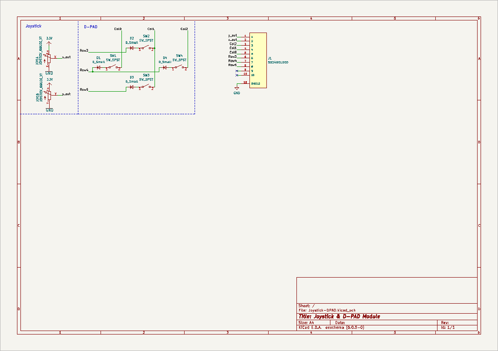
|:--:|
| *NJoystick/D-Pad Module KiCAD Schematic.* |

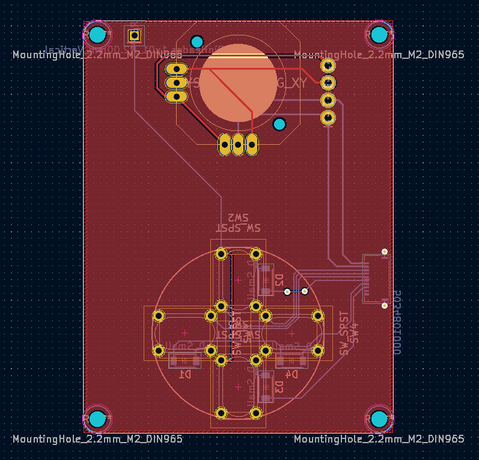
|:--:|
| *Joystick/D-Pad Module PCB Routing and Component Placement.* |

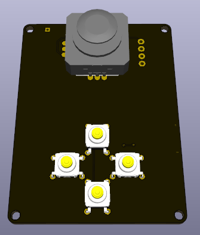
|:--:|
| *3D Render of Joystick/D-Pad Module PCB.* |

Joystick BOM
------------

NumPad module PCB manufactured by PCBway's PCB fabrication service. The following table details the components used within the module, along with information on pricing for the actual PCB.

| Component | Cost | Link |
| --- | --- | --- |
| KSA1M331LFT SPST-NO | $0.91 | https://www.digikey.com/en/products/detail/c-k/KSA1M331LFT/1003897 |
| FPC 10Pin Connector | $1.13 | https://www.digikey.com/en/products/detail/molex/5034801000/2356624 |
|1N4148WTPMSCT-ND Diode| $0.03816 | https://www.digikey.com/en/products/detail/micro-commercial-co/1N4148W-TP/717196 |
| Mini Analog Thumbstick | $2.50 | https://www.adafruit.com/product/2765?gclid=CjwKCAjw6raYBhB7EiwABge5Kk9TZn8ilWmRzUdasBMNh74FXIZQBJh3K6sDLgbHT71pnA3cYCJrNRoC1E8QAvD_BwE |
|Joystick/D-Pad Module PCB| $38.18 |  |

[^1]: https://www.pcbway.com/rapid-prototyping/3D-Printing/3D-Printing-SLA.html
