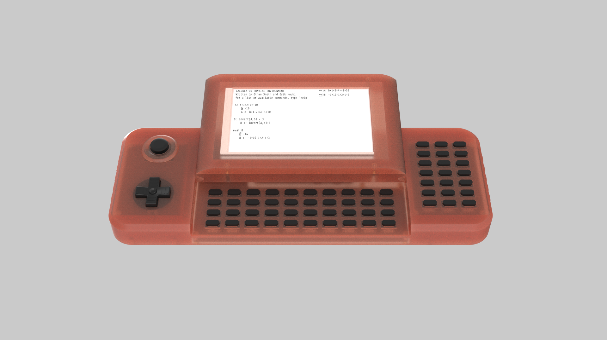

# Design
Depicts vaious design aspects associates with this project.

Table of contents
=================

<!--ts-->
   * [Case](#Case)
      * [Case BOM](#CaseBOM)
   * [Keyboard Module](#Keyboard)
      * [Keyboard BOM](#KeyboardBOM)
   * [NumPad Module](#NumPad)
      * [NumPad BOM](#NumPadBOM)
   * [Joystick/D-PAD Module](#Joystick)
      * [Joystick BOM](#JoystickBOM)
<!--te-->


Case
====


|:--:| 
| *Enclosure rendered for the calculator.* |


## Single Board Computer
| Name | Cost | Link |
| --- | --- | --- |
| Raspberry Pi Zero | $(FREE) | https://www.raspberrypi.com/products/raspberry-pi-zero/ |

## Screen 
| Screen | Cost | Link |
| --- | --- | --- |
| 4.0" TFT Display | $54.95 | https://www.adafruit.com/product/3932 |

## Keyboard 

###### RP2040 Board
| Component | Cost | Link |
| --- | --- | --- |
| RP2040 Stamp | $12.00 | https://www.tindie.com/products/arturo182/rp2040-stamp/ |

###### USB Micro B
| Component | Cost | Link |
| --- | --- | --- |
| 10103594-0001LF | $0.77 | https://www.digikey.com/en/products/detail/amphenol-cs-fci/10103594-0001LF/2350351 |

###### Switches & Caps
| Component | Cost | Link |
| --- | --- | --- |
| KSA1M331LFT SPST-NO | $0.91 | https://www.digikey.com/en/products/detail/c-k/KSA1M331LFT/1003897 |
| Tactile Cap Oval (BLACK) | $0.39 | https://www.digikey.com/en/products/detail/c-k/BTNK0390/559405 |
| D-Pad Button(Black) | $3.40 | https://www.ebay.com/itm/182260383344?hash=item2a6f90be70:g:KzUAAOSwFV9XxCYp |

###### Joystick
| Component | Cost | Link |
| --- | --- | --- |
| Mini Analog Thumbstick | $2.50 | https://www.adafruit.com/product/2765?gclid=CjwKCAjw6raYBhB7EiwABge5Kk9TZn8ilWmRzUdasBMNh74FXIZQBJh3K6sDLgbHT71pnA3cYCJrNRoC1E8QAvD_BwE |

# Example Hardware Code

## Joystick

```
"""
The joystick module is an Analog device, comprising of two 10kΩ potentiometers. 
X & Y will be determined via two analog reading pins on the microcontroller. 
Pins 34/32/31 are designated ADC pins on RP2040. 
"""
import board
from analogio import AnalogIn
import usb_hid
from adafruit_hid.mouse import Mouse

mouse = Mouse(usb_hid.devices)
xAxis = AnalogIn(board.A1)
yAxis = AnalogIn(board.A0)

in_min,in_max,out_min,out_max = (0, 65000, -5, 5)
filter_joystick_deadzone = lambda x: int((x - in_min) * (out_max - out_min) / (in_max - in_min) + out_min) if abs(x - 32768) > 500 else 0


while True:
    x_offset = filter_joystick_deadzone(xAxis.value) * -1 #Invert axis
    y_offset = filter_joystick_deadzone(yAxis.value)
    mouse.move(x_offset, y_offset, 0)
```
